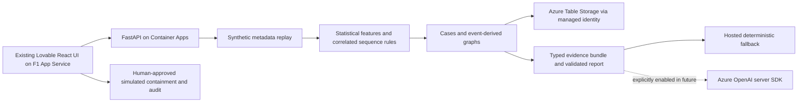

# AgentDrift

**Live Azure demo: [agentdrift-personal-demo.azurewebsites.net](https://agentdrift-personal-demo.azurewebsites.net/)**

**Every permission was valid. The sequence wasn't.**

AI-agent metadata movement investigation with Python behavioral detection, linked evidence graphs and human-approved simulated response. Independent synthetic-data work sample; no Hilt endorsement.


The existing Lovable UI is preserved: React 19, TanStack Start/Router/Query, React Flow, Tailwind and Radix. FastAPI/Pydantic provides six deterministic scenarios, historical baselines, robust volume/novelty rules, temporal correlation, persisted cases, citation-validated reports and audited simulation. SQLite supports local development; The live deployment uses Azure Table Storage with managed identity. Azure OpenAI is implemented server-side with strict event-tuple validation, persistent attempt quotas and explicit generation controls. **The hosted demo uses deterministic fallback; no live model invocation has been verified.** The owner opted for no new model costs. See [the upgrade audit](docs/genai-upgrade-audit.md) and [grounding design](docs/llm-grounding.md).

**Live demo:** [AgentDrift personal demo](https://agentdrift-personal-demo.azurewebsites.net) · [API health](https://agentdrift-api.icydune-d7187e3c.canadacentral.azurecontainerapps.io/health). The public Chromium workflow passed, including deep-link refresh and zero page errors. [Repository](https://github.com/PeterYousefi/agentdrift) · [Architecture](docs/architecture.md) · [Deployment and preflight price detail](docs/azure-deployment.md).

## Architecture



A single worker/replica serializes mutations and persistent attempt quotas. Local storage is SQLite; cloud storage is Azure Tables. Sequence correlation uses a bounded 900-second horizon independently of 300-second volume windows. Trusted ordinary export allowances change alert policy while preserving raw volume deviations. These rules are transparent policy, not a trained ML classifier.

## Local demo

Python 3.12+ and Node 24:

```sh
make setup
make api
# In another terminal:
make web
```

Open http://localhost:3000. Default frontend mode calls http://localhost:8000/api/v1. OpenAPI is at http://localhost:8000/docs. No Azure credential or model key is needed for the deterministic local demo. Environment templates are .env.example and lovable/.env.example; export backend variables when needed. Azure variables are required only for cloud storage/model integration. Never commit real environment files.

```sh
make test
make evaluate
cd lovable
npx playwright install chromium
npx playwright test   # local API and frontend must be running
npm run build        # generates static SPA shell under .output/public
```

Container: `docker build -t agentdrift backend`. Production configuration requires durable Azure storage and will refuse ephemeral SQLite.

## Executed verification

73 pytest tests pass, with one opt-in live-model test skipped; 21 frontend Vitest tests and four Chromium/API end-to-end workflows pass locally. Frontend build, TypeScript and lint pass; lint retains seven existing fast-refresh warnings. GitHub validation ran backend, Docker, frontend and browser jobs successfully. The image is available from public GHCR; Azure deployment workflow remains gated.

Rules-1.2 uses a separate development set and was committed before fresh evaluation. Detection Lab defaults to the **combined 380-run held-out set**, including ambiguity probes, rather than advertising only the perfect narrower result.

| Investigation task | Rules-1.1 precision / recall / FPR | Rules-1.2 precision / recall / FPR |
|---|---|---|
| Existing 260-run regression | 50% / 80% / 50% | 100% / 100% / 0% |
| Fresh 260-run challenge | 50% / 80% / 50% | 100% / 100% / 0% |
| Fresh 120 ambiguity probes | 33.3% / 25% / 100% | 0% / 0% / 100% |
| **Combined 380 fresh runs** | **45.5% / 55.6% / 60%** | **71.4% / 55.6% / 20%** |

The combined confusion matrix is TP100 FP40 TN160 FN80; F1 is 0.625. Fewer legitimate-volume/cold-start alerts and more split-window detections come with missed solitary suspicious transfers to trusted endpoints. The original tuned 120-run regression remains 80 TP, 0 FP, 40 TN, 0 FN. These are synthetic review labels, not maliciousness classifications. [Machine-readable results](backend/evaluation.json), [methodology](docs/evaluation.md) and [launch protocol](docs/launch-pass.md) preserve the weaker outcomes and distribution limits. No post-held-out detector tuning was performed.

Scenarios: normal research, volume spike, novel endpoint, sensitive read → stage → send, low-and-slow drift and benign unusual reporting. The same run has stable event IDs; fresh replay runs isolate evidence and policy state. See the [three-minute script](docs/demo-script.md).

## Engineering notes

[Frontend audit](docs/frontend-audit.md) · [Data model](docs/data-model.md) · [Detection](docs/detection-design.md) · [Evidence provenance](docs/evidence-provenance.md) · [LLM grounding](docs/llm-grounding.md) · [Threat model](docs/threat-model.md) · [Limitations](docs/limitations.md).

The MVP uses a single replica, REST polling/SSE and transparent rules. There is no Event Hubs, Kafka or ML integration claim. Rate limits and sessions provide basic public-demo isolation, not production hardening. Human approval affects synthetic policy only: no real data transfer, credential rotation, cloud quarantine or destructive containment occurs. Azure budget alerts notify after billing data arrives and cannot guarantee a hard spending ceiling.
