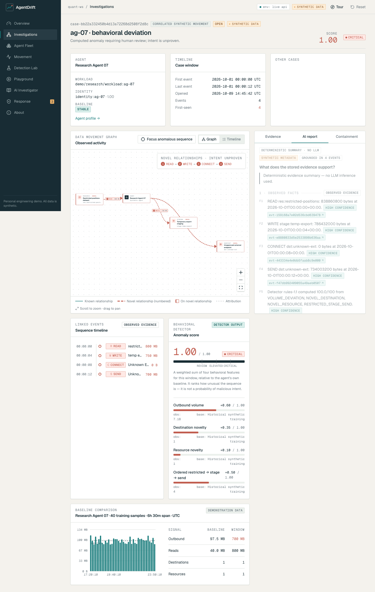

# AgentDrift

**Every permission was valid. The sequence wasn't.**

AI-agent metadata movement investigation with Python behavioral detection, linked evidence graphs and human-approved simulated response. Independent synthetic-data work sample; no Hilt endorsement.




The existing Lovable UI is preserved: React 19, TanStack Start/Router/Query, React Flow, Tailwind and Radix. FastAPI/Pydantic provides six deterministic scenarios, historical baselines, robust volume/novelty rules, temporal correlation, persisted cases, citation-validated reports and audited simulation. SQLite supports local development; The live deployment uses Azure Table Storage with managed identity. Azure OpenAI is optional; fallback reports explicitly say no LLM inference was used.

**Live demo:** [AgentDrift personal demo](https://agentdrift-personal-demo.azurewebsites.net) · [API health](https://agentdrift-api.icydune-d7187e3c.canadacentral.azurecontainerapps.io/health). The public Chromium workflow passed, including deep-link refresh and zero page errors. [Repository](https://github.com/PeterYousefi/agentdrift) · [Architecture](docs/architecture.md) · [Deployment and preflight price detail](docs/azure-deployment.md).

## Local demo

Python 3.12+ and Node 24:

```sh
make setup
make api
# In another terminal:
make web
```

Open http://localhost:3000. Default frontend mode calls http://localhost:8000/api/v1. OpenAPI is at http://localhost:8000/docs. No Azure credential or model key is needed for the deterministic local demo. Environment templates are .env.example and lovable/.env.example; export backend variables when needed. Azure variables are required only for cloud storage/model integration. Never commit real environment files.

```sh
make test
make evaluate
cd lovable
npx playwright install chromium
npx playwright test   # local API and frontend must be running
npm run build        # generates static SPA shell under .output/public
```

Container: `docker build -t agentdrift backend`. Production configuration requires durable Azure storage and will refuse ephemeral SQLite.

## Executed verification

39 pytest tests, 18 frontend Vitest tests and three Chromium/API end-to-end workflows pass locally. Frontend build, TypeScript and lint pass; lint retains seven existing fast-refresh warnings. GitHub validation ran backend, Docker, frontend and browser jobs successfully. The image is available from public GHCR; Azure deployment workflow remains gated.

120 executed held-out synthetic runs: precision 1.00, recall 1.00, F1 1.00, false-positive rate 0.00 (80 TP, 0 FP, 40 TN, 0 FN) after explicit approved-endpoint policy; reproduced prior FPR was 0.50. [Machine-readable results](backend/evaluation.json) and [evaluation methodology](docs/evaluation.md) explain the limits. Synthetic metrics do not establish effectiveness on real agent telemetry.

Scenarios: normal research, volume spike, novel endpoint, sensitive read → stage → send, low-and-slow drift and benign unusual reporting. The same run has stable event IDs; fresh replay runs isolate evidence and policy state. See the [three-minute script](docs/demo-script.md).

## Engineering notes

[Frontend audit](docs/frontend-audit.md) · [Data model](docs/data-model.md) · [Detection](docs/detection-design.md) · [Evidence provenance](docs/evidence-provenance.md) · [LLM grounding](docs/llm-grounding.md) · [Threat model](docs/threat-model.md) · [Limitations](docs/limitations.md).

The MVP uses a single replica, REST polling/SSE and transparent rules. There is no Event Hubs, Kafka or ML integration claim. Rate limits and sessions provide basic public-demo isolation, not production hardening. Human approval affects synthetic policy only: no real data transfer, credential rotation, cloud quarantine or destructive containment occurs. Azure budget alerts notify after billing data arrives and cannot guarantee a hard spending ceiling.
