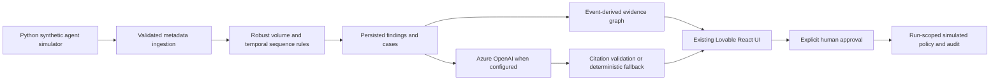

# Architecture

Implemented locally: FastAPI, typed models, six deterministic generators, idempotent ingestion, historical baselines, feature extraction, cases, graphs, reports, approvals, polling and SSE snapshots. Azure resources are prepared in Bicep, not deployed yet.

Frontend retains TanStack Start, Query, Router, React Flow, Radix and the Lovable design system. SPA shell generation supports Azure Static Web Apps route fallback. The original fixture mode is opt-in via VITE_DEMO_MODE=true; default mode calls FastAPI and surfaces errors.

Cloud plan: Free Static Web Apps; Consumption Container Apps (0–1 replica, 0.25 vCPU/0.5 GiB); Standard LRS Table Storage; managed identity for table access; free public GHCR image. No Event Hubs, Kafka, Kubernetes, paid registry, paid model deployment, Log Analytics ingestion or managed database is provisioned.

The processor advances persisted elapsed-time replay on browser polling/SSE and through a ten-second background sweep. At scale-to-zero, it catches up on the next request. This is asynchronous synthetic replay, not a distributed event stream. Single replica and a process lock serialize mutations. Multi-replica execution requires distributed leases and optimistic transactions.
